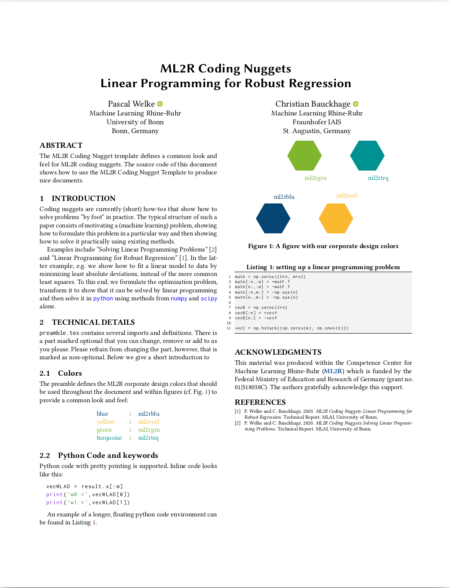

# Lamarr Coding Nugget Template

This repository provides a LaTeX template and an example file to create "Lamarr Coding Nuggets" in a common look and feel. 
You can check out how the template will look [here](main.pdf) or in the thumbnail below.
(The thumbnail was created with [iconify.sh](iconify.sh)). 

Go write your own coding nugget!

## What is this all about?

We have started to publish Lamarr Coding Nuggets on [ResearchGate](https://www.researchgate.net/project/Machine-Learning-Rhine-Ruhr-ML2R) and on a [website of the University of Bonn](https://mlai.cs.uni-bonn.de/teaching/lecturenotes) and are looking for volunteers to support and contribute to specific topics.

Coding Nuggets are currently (short) how-tos that show how to solve problems “by foot” in practice. The typical structure of such a paper consists of motivating a (machine learning) problem, showing how-to formulate this problem in a particular way and then showing how to solve it practically using existing methods. 

Christian Bauckhage and Pascal Welke have already created two Coding Nuggets as an example ([Solving Linear Programming Problems](https://mlai.cs.uni-bonn.de/lecturenotes/ml2r-cn-linearprogramming1.pdf) & [Linear Programming for Robust Regression](https://mlai.cs.uni-bonn.de/lecturenotes/ml2r-cn-linearprogramming2.pdf)).

If you have an interesting topic that you want to present to a technical audience (think CS students) and are not sure if it is suitable for a coding nugget, let's discuss!  

So far, the Lamarr Coding Nuggets will be published on ResearchGate and the Uni Bonn webpage. The second one has the advantage that it will eventually be indexed and show up on Google scholar.

## So how to get started?

- Choose a topic: There is a wide range of topics you can write about. For guidance and orientation, you can check out the [coding nuggets that already exist](https://mlai.cs.uni-bonn.de/teaching/lecturenotes)
- Download this repository and start by editing [main.tex](main.tex). You will find some technical documentation in this file that should help you understanding the relevant commands.
- Write your own Lamarr Coding Nugget.
- Send the final version to [Christian Bauckhage](christian.bauckhage@iais.fraunhofer.de) and [Pascal Welke](welke@cs.uni-bonn.de) for publication on ResearchGate and the website.

## Contact
If you have any questions regarding technical details or whether a topic that you have in mind is suitable as a coding nugget, feel free to contact [Pascal Welke](welke@cs.uni-bonn.de).
